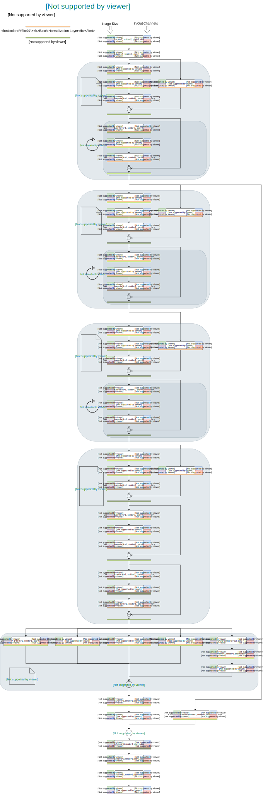

# deeplab v3+ illustration
An illustration of deeplab v3+ architecture (ResNet101 backbone). 

Thanks to the amazing drawing tool [draw.io](https://www.draw.io). I've also uploaded the raw xml file. You can open it in [draw.io](https://www.draw.io) and make modifications.

### Reference
1. [deeplab-pytorch](https://github.com/kazuto1011/deeplab-pytorch)
2. [pytorch-deeplab-xception](https://github.com/jfzhang95/pytorch-deeplab-xception)
3. [official pytorch implementation of ResNet](https://github.com/pytorch/vision/blob/master/torchvision/models/resnet.py)
4. [Encoder-Decoder with Atrous Separable Convolution for Semantic Image Segmentation](https://arxiv.org/abs/1802.02611)
5. [Rethinking Atrous Convolution for Semantic Image Segmentation](https://arxiv.org/abs/1706.05587)
6. [Deep Residual Learning for Image Recognition](https://arxiv.org/abs/1512.03385)

